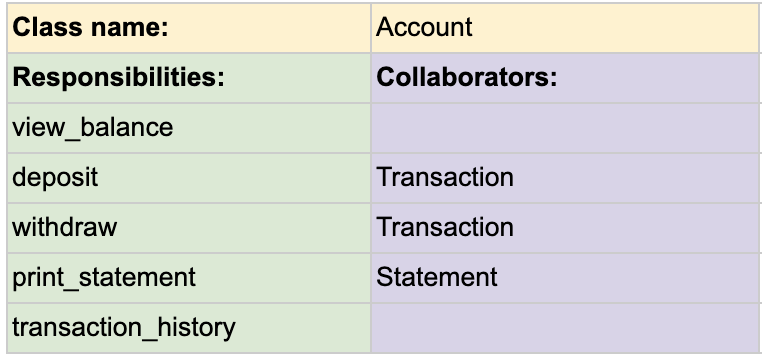
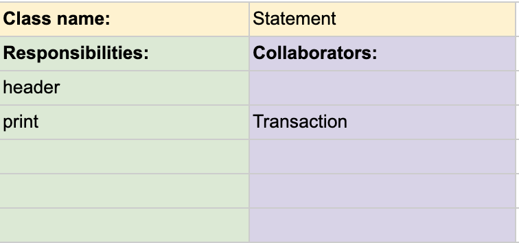
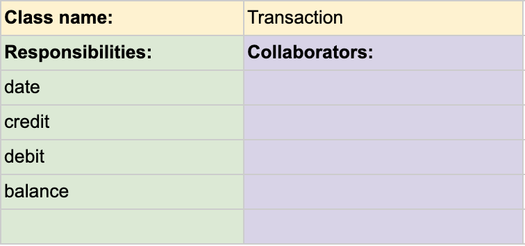
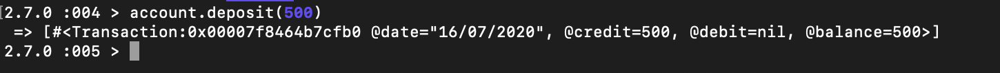
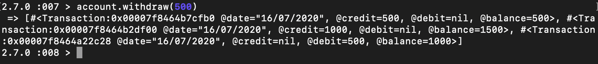
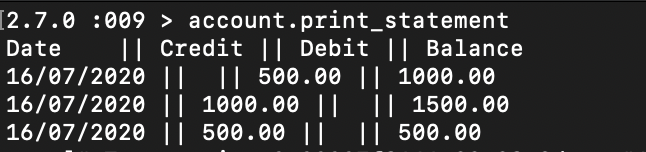

# Bank Tech Test

## Specification
### Requirements
- You should be able to interact with your code via a REPL like IRB or the JavaScript console. (You don't need to implement a command line interface that takes input from STDIN.)
- Deposits, withdrawal.
- Account statement (date, amount, balance) printing.
- Data can be kept in memory (it doesn't need to be stored to a database or anything).
### Acceptance criteria
**Given** a client makes a deposit of 1000 on 10-01-2012
**And** a deposit of 2000 on 13-01-2012
**And** a withdrawal of 500 on 14-01-2012
**When** she prints her bank statement
**Then** she would see
```
date || credit || debit || balance
14/01/2012 || || 500.00 || 2500.00
13/01/2012 || 2000.00 || || 3000.00
10/01/2012 || 1000.00 || || 1000.00
```

### User Stories
```
As a customer
so I can spend my money
I would like to deposit my money into an account
```
```
As a customer
so I can buy something
I would like to withdraw money from my account
```
```
As a customer
so I can keep track on my account
I would like to print out my account statement
```
### Domain Model Planning




### Quick Start
Clone this repo.

1 Install gems with:
```
bundle
```
2 Run test suites with:
```
rspec && rubocop
```
3 Launch IRB:
```
irb
```
4 Once in IRB:
```
require './lib/account.rb'
account = Account.new
```
Use your account with the following methods:

- **account.deposit(amount)**

- **account.withdraw(amount)**

- **account.print_statement**
